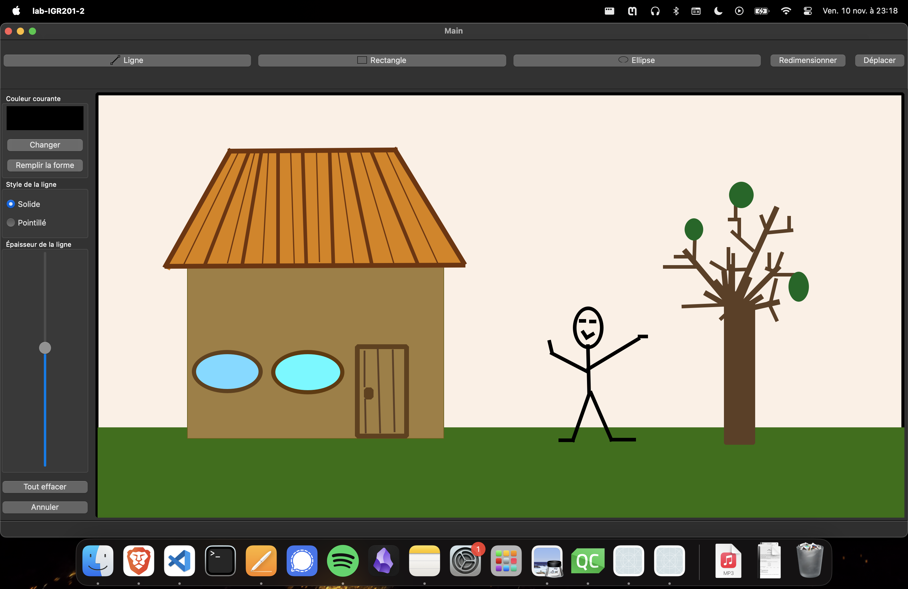

# Painting App Readme

## Overview
This painting app, developed using Qt 6.5.2 and Qt Creator, provides a user-friendly interface for creating and manipulating drawings. The app supports various features such as drawing shapes, changing brush styles and colors, filling shapes, moving them, and resizing them. Whether you're an artist or just looking to have some creative fun, this app makes it easy to express your ideas through digital drawings.

## How to Use
### Requirements
- Qt 6.5.2 or later installed
- Qt Creator for building and running the application

### Building and Running the App
1. Clone this repository to your local machine.
```
git clone https://github.com/your-username/painting-app.git
cd painting-app
```

2. Open the project in Qt Creator.
- Launch Qt Creator.
- Select "File" -> "Open File or Project" and navigate to the cloned repository.
- Open the project file (usually ends with `.pro`).

3. Configure the project.
- Ensure that the Qt version is set to 6.5.2 or later.
- Configure any additional build settings if necessary.

4. Build and run the application.
- Click on the green play button or press `Ctrl + R` to build and run the app.

### App structure
- `mainwindow` : deals with the UI and register the signals
- `drawingPanel` : handles the canvas and the drawing
- `customShape` : is meant to represent either a line, a rectangle or an ellipse and handle the different propreties of each one
- `resizeHandle` : is the class for the resizing tools (the squares in the corner of a shape) when the user is editing a shape (resizing or moving)

### Features 

#### Drawing mode
Selecting a shape type from the top menu allow you to trigger the drawing mode.
You can then draw shapes by first clicking on the canvas and then moving the mouse to plot the shape.

#### Color
You can change the color of the line using the "Changer" button.
You can also click on "Remplir la forme" to fill the last shape drawn with the current color.
*Note : You can fill a shape with a different color than its contour*

#### Line style
You can switch between to a dashed line selecting "Pointillé"

##### Line thickness
You can change the line thickness using the slider

##### Erasing
You can erase the last shape drawn or even erase all shapes using "Annuler" and "Tout effacer" buttons

#### Resizing mode
When you switch to resizing mode you can select a shape by clicking on it (even for non-filled shapes).
Once a shape is selected you can resize it using the small squares in the corner of the shape's bouding box by clicking on those blue squares and moving your mouse.

#### Moving mode
When you switch to resizing mode you can select a shape by clicking on it (even for non-filled shapes).
You then drag the shape by keeping your mouse down while moving and it moves.


## Screenshots




